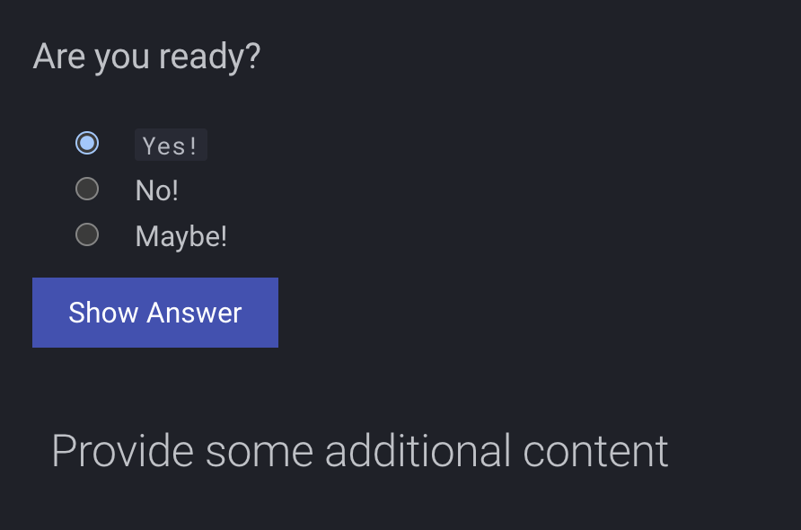
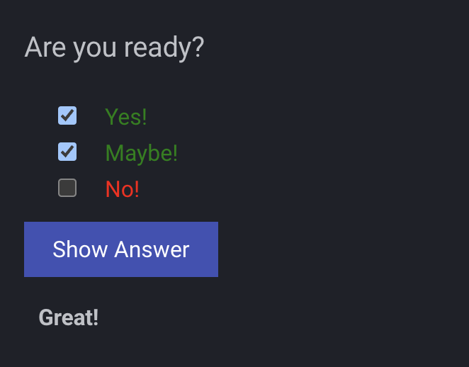

# MkDocs Exam Plugin

## Installation

This plugin hasn't landed on PyPI yet. Clone the repository and install it in editable mode with **uv**:

```bash
git clone https://github.com/kjanat/mkdocs-exam.git
cd mkdocs-exam
uv pip install -e .
```

## Create your first exam

Add the following to your `mkdocs.yml`:

```yaml
plugins:
  - mkdocs-exam
```

### Single choice

Now you can create your first exam directly in markdown:

```markdown
<exam>
question: Are you ready?
answer-correct: Yes!
answer: No!
answer: Maybe!
content:
<h2>Provide some additional content</h2>
</exam>
```

> [!NOTE]
> The answers can get styled with HTML (like `<code>Yes!</code>`)

> [!IMPORTANT]
> The exam content needs to be valid **_HTML_**

### Multiple choice

You can also create a multiple choice exam, by providing multiple answers as correct.

```markdown
<exam>
question: Are you ready?
answer-correct: Yes!
answer: No!
answer-correct: Maybe!
content:
<h2>Provide some additional content</h2>
</exam>
```

### Short answer

Provide the expected answer as `answer-correct` and set the type to `short-answer`:

```markdown
<exam>
type: short-answer
question: What color is the sky?
answer-correct: blue
content:
<p>The sky often appears blue due to Rayleigh scattering.</p>
</exam>
```

### Fill in the blank

Use three underscores (`___`) as placeholder in your question and provide the correct answer.

```markdown
<exam>
type: fill
question: 2 + 2 = ___
answer-correct: 4
content:
<p>A simple addition problem.</p>
</exam>
```

### True/false

This type can be used for simple statements that are either true or false. If no
answers are provided, the plugin will automatically use *True* and *False*.

```markdown
<exam>
type: truefalse
question: The Earth orbits the Sun.
answer-correct: True
content:
<p>This is obviously true.</p>
</exam>
```

### Essay

For longer open questions the `essay` type renders a multiline textarea.

```markdown
<exam>
type: essay
question: Explain the theory of relativity in one paragraph.
answer-correct: It deals with space and time.
content:
<p>Provide an explanation.</p>
</exam>
```

## [Demo](https://kjanat.github.io/mkdocs-exam/)

## Screenshots

The single choice exam will get generated as a radio button group, while the multiple choice exam will get generated as a checkbox group.

### Single choice



### Multiple choice



## Disable for a page

You can disable the exam for a page by adding the following to the top (meta) of the page:

```markdown
---
exam: disable
---
```

## License

This project is licensed under the [MIT License](LICENSE).
