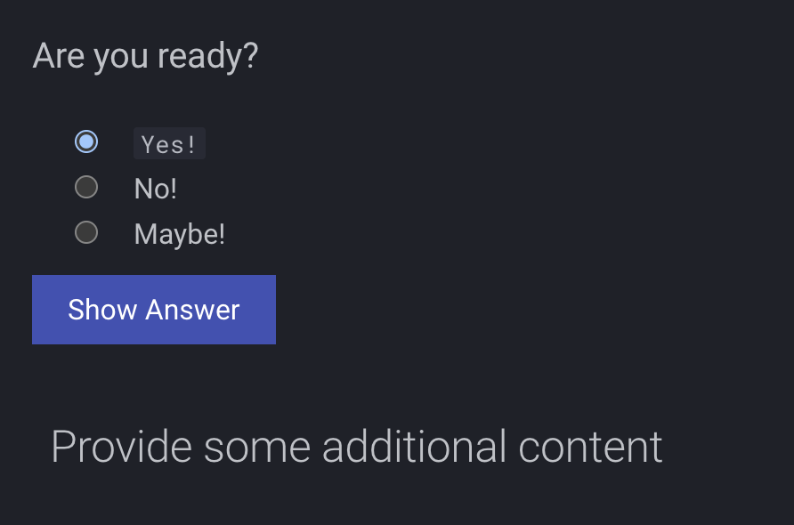
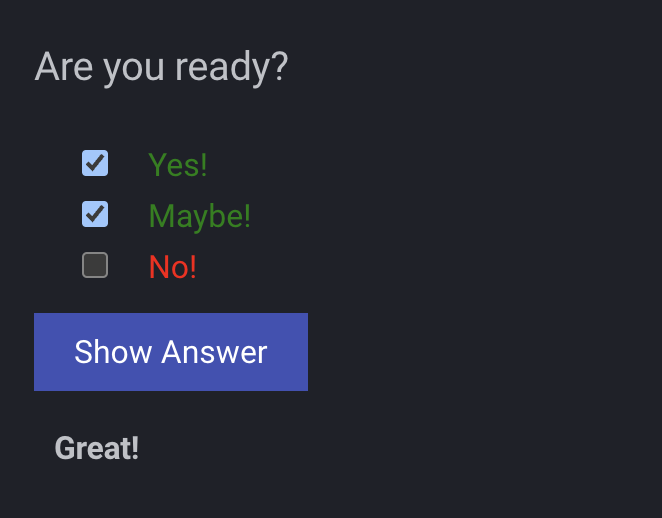

# MkDocs Exam Plugin

## Installation

This plugin hasn't landed on PyPI yet. Clone the repository and install it in editable mode with **uv**:

```bash
git clone https://github.com/kjanat/mkdocs-exam.git
cd mkdocs-exam
uv pip install -e .
```

## Create your first exam

Add the following to your `mkdocs.yml`:

```yaml
plugins:
  - mkdocs-exam
```

### Single choice

Now you can create your first exam directly in markdown:

```markdown
<exam>
question: Are you ready?
answer-correct: Yes!
answer: No!
answer: Maybe!
content:
<h2>Provide some additional content</h2>
</exam>
```

> [!NOTE]
> The answers can get styled with HTML (like `<code>Yes!</code>`)

> [!IMPORTANT]
> The exam content needs to be valid **_HTML_**

### Multiple choice

You can also create a multiple choice exam, by providing multiple answers as correct.

```markdown
<exam>
question: Are you ready?
answer-correct: Yes!
answer: No!
answer-correct: Maybe!
content:
<h2>Provide some additional content</h2>
</exam>
```

### Short answer

Provide the expected answer as `answer-correct` and set the type to `short-answer`:

```markdown
<exam>
type: short-answer
question: What color is the sky?
answer-correct: blue
content:
<p>The sky often appears blue due to Rayleigh scattering.</p>
</exam>
```

### Fill in the blank

Use three underscores (`___`) as placeholder in your question and provide the correct answer.

```markdown
<exam>
type: fill
question: 2 + 2 = ___
answer-correct: 4
content:
<p>A simple addition problem.</p>
</exam>
```

### True/false

This type can be used for simple statements that are either true or false. If no
answers are provided, the plugin will automatically use _True_ and _False_.

```markdown
<exam>
type: truefalse
question: The Earth orbits the Sun.
answer-correct: True
content:
<p>This is obviously true.</p>
</exam>
```

### Essay

For longer open questions the `essay` type renders a multiline textarea.

```markdown
<exam>
type: essay
question: Explain the theory of relativity in one paragraph.
answer-correct: It deals with space and time.
content:
<p>Provide an explanation.</p>
</exam>
```

### Matching

Provide pairs separated by a pipe (`|`). Each left item will be shown with a
drop-down to select the corresponding right item.

```markdown
<exam>
type: matching
question: Match the capitals to countries
answer: Paris | France
answer: Rome | Italy
answer: Madrid | Spain
content:
<p>Capitals and their countries.</p>
</exam>
```

## [Demo](https://kjanat.github.io/mkdocs-exam/)

## Screenshots

The single choice exam will get generated as a radio button group, while the multiple choice exam will get generated as a checkbox group.

### Single choice



### Multiple choice



## Configuration

You can configure the plugin behavior in your `mkdocs.yml`:

```yaml
plugins:
  - mkdocs-exam:
      submit_text: "Check Answers"  # Custom submit button text (default: "Submit")
      reset_text: "Start Over"      # Custom reset button text (default: "Try Again")
      show_score: true               # Show score display (default: true)
      allow_retry: true              # Show reset button (default: true)
      essay_rows: 6                  # Textarea rows for essay questions (default: 4)
```

## Disable for a page

You can disable the exam for a page by adding the following to the top (meta) of the page:

```markdown
---
exam: disable
---
```

## Features

### Accessibility

The plugin includes comprehensive accessibility features:

- **ARIA attributes**: All interactive elements have proper ARIA labels
- **Screen reader support**: Exam results are announced via live regions
- **Keyboard navigation**: Full keyboard support with visible focus indicators
- **Visual indicators**: Checkmark (✓) and cross (✗) icons supplement color coding
- **High contrast mode**: Supports `prefers-contrast: high`
- **Reduced motion**: Respects `prefers-reduced-motion` preference

### Responsive Design

Exams are fully responsive and work on:

- Desktop browsers
- Tablets
- Mobile devices

Buttons stack vertically on smaller screens for better usability.

### Print Support

Exams can be printed with:

- Visible correct answers
- Hidden interactive elements
- Proper page breaks

### Theming

The plugin integrates with MkDocs Material theme via CSS custom properties. You can customize colors by overriding:

```css
:root {
  --exam-correct-color: #00e676;
  --exam-wrong-color: #f44336;
  --exam-border-color: #ccc;
}
```

## Troubleshooting

### Tests aren't running locally

**Issue**: `ModuleNotFoundError: No module named 'mkdocs_exam'`

**Solution**: Install the package in editable mode:

```bash
uv pip install -e .
pytest tests/ -v
```

### Exams not showing up

**Issue**: Exam blocks appear as raw text

**Solutions**:

1. Check that the plugin is enabled in `mkdocs.yml`:
   ```yaml
   plugins:
     - mkdocs-exam
   ```

2. Verify exam block syntax:
   - Must have `<exam>` and `</exam>` tags
   - Must include `content:` section
   - Must have at least one `question:` field

3. Check browser console for JavaScript errors

### Styling looks broken

**Issue**: Exams have no styling or look unstyled

**Solutions**:

1. Clear browser cache
2. Check that CSS is being injected (view page source)
3. Verify no CSS conflicts with custom themes
4. Try disabling other MkDocs plugins to identify conflicts

### Parse errors

**Issue**: "Exam Parse Error" shown instead of exam

**Causes**:

- Missing required fields (`question:`, `content:`)
- Invalid question type
- Malformed matching answers (missing `|` separator)

**Solution**: Check the error message for specific validation failures

### XSS warnings from security scanners

**Note**: Version 0.2.0+ includes HTML escaping for all user input. If you're seeing XSS warnings, ensure you're using the latest version.

## FAQ

### Can I use HTML in questions and answers?

For security reasons, **no**. Version 0.2.0+ escapes all HTML in questions and answers to prevent XSS attacks. However, you can use HTML in the `content:` section.

### Can I have multiple exams on one page?

Yes! You can include as many `<exam>` blocks as you want on a single page.

### Do exam results get saved?

No. The plugin performs client-side validation only. Results are not stored or sent to a server. This is intentional to keep the plugin simple and privacy-friendly.

### Can I customize the styling?

Yes! The plugin uses CSS custom properties. You can override them in your own CSS:

```css
:root {
  --exam-correct-color: #your-color;
  --exam-wrong-color: #your-color;
}
```

### Is there a limit to answer length?

No hard limit, but very long answers may affect layout. For essay questions, consider appropriate `essay_rows` configuration.

### Can I disable the reset button?

Yes, set `allow_retry: false` in your plugin configuration.

### Does it work offline?

Yes! All CSS and JavaScript are inlined, so exams work without internet connection.

### What browsers are supported?

Modern browsers supporting:

- CSS custom properties
- ES6 JavaScript
- `<details>` element
- Flexbox

Tested on: Chrome, Firefox, Safari, Edge (latest versions)

### Can I translate button text?

Yes! Use the `submit_text` and `reset_text` configuration options to provide text in any language.

### How do I report a bug?

Open an issue on [GitHub](https://github.com/kjanat/mkdocs-exam/issues) with:

- MkDocs version
- Plugin version
- Example exam block that reproduces the issue
- Expected vs actual behavior

### How can I contribute?

See [CONTRIBUTING.md](CONTRIBUTING.md) for development setup and guidelines.

## Changelog

See [CHANGELOG.md](CHANGELOG.md) for version history and release notes.

## License

This project is licensed under the [MIT License](LICENSE).
